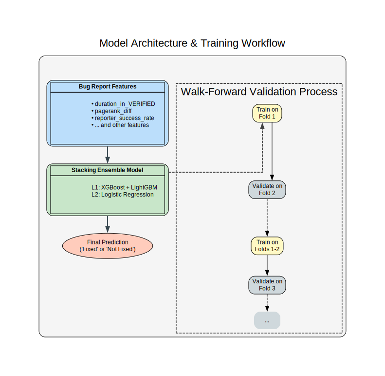
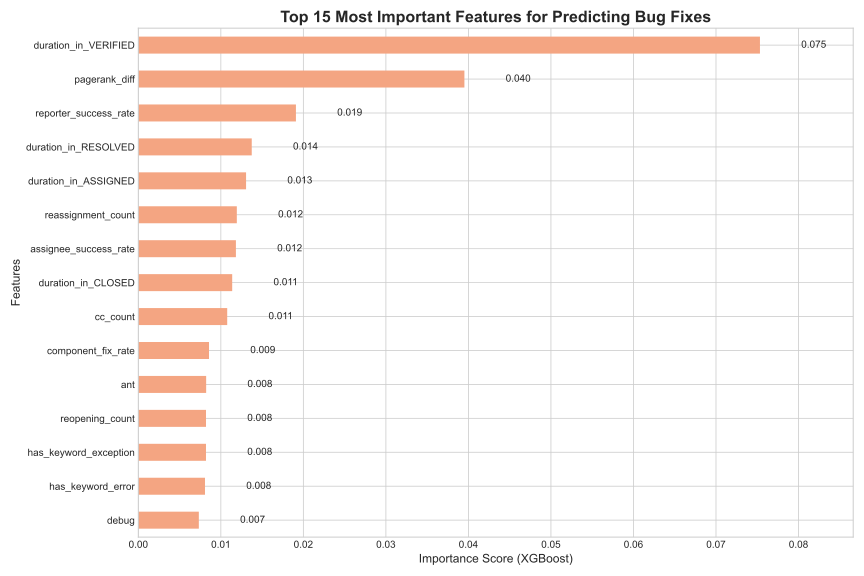
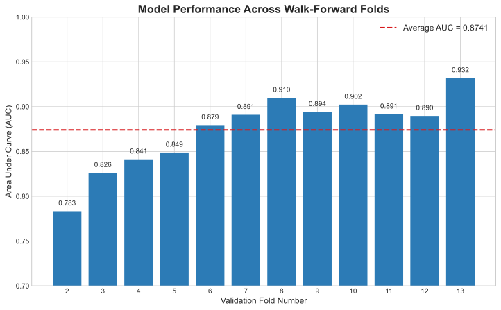
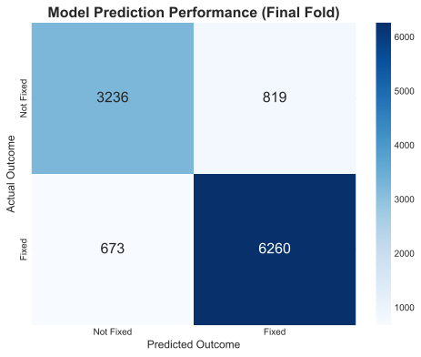
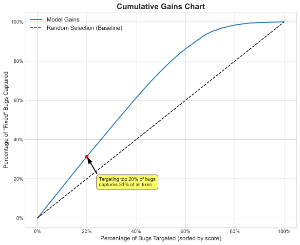

# Eclipse
# Predicting Software Bug Fixes: A Data-Driven Approach

## 1. Project Overview

In large software projects, managing thousands of bug reports is a major challenge. The process of **bug triaging**—deciding which bugs to prioritize—is often manual, time-consuming, and inefficient.

This project tackles that challenge by using a predictive model to accurately forecast which bugs are most likely to be fixed. Understanding these key drivers enables the creation of smarter triaging policies that help development teams:

* **Focus resources** on bugs that matter.
* **Increase developer efficiency** and productivity.
* **Set clear expectations** for users who report bugs.

---

## 2. The Solution: A "Team of Experts" Model

To make the most accurate predictions, this solution does not rely on a single model. Instead, it utilizes a **Stacking Ensemble**, which works like a "team of experts."

As shown in the diagram below, bug report data is fed to two independent expert models (XGBoost and LightGBM). These models analyze the problem from different angles and each provides a recommendation. A final "judge" model then weighs the opinions of the two experts to make the final, most robust prediction.

To ensure the model performs well in a real-world scenario, a technique called **Walk-Forward Validation** was used. This means the model was trained on historical data and tested on future data, repeating the process over time to prove its effectiveness is stable and reliable.

---

## 3. Key Factors That Predict a Fix

The model identified several key factors that strongly influence whether a bug will be fixed. The chart below shows the top 15 most important features the model uses.

These factors can be grouped into a few simple categories:

* **Bug Lifecycle & History**: The most important factor is **how long a bug spends in the "VERIFIED" state**. Bugs that are quickly verified but then sit for a long time are less likely to be fixed. Other historical factors like reassignment count and the number of people following a bug (`cc_count`) are also important.
* **People & Reputation**: The model considers the "influence" of the reporter and the assigned developer (`pagerank_diff`) as well as the historical success rate of the person who reported the bug (`reporter_success_rate`). High-quality reports from reputable sources get fixed more often.
* **Bug Report Content**: The presence of specific keywords like `exception` or `error` in the bug description serves as a clear signal of its importance.

---

## 4. Model Performance & Business Value

The model demonstrates consistently high performance and provides clear business value.

### Overall Performance

The model's ability to distinguish between bugs that will be fixed versus those that won't is excellent, with an **average AUC score of 0.8741** (where 1.0 is a perfect score). The chart below shows that the model's performance remained strong and even improved over time across all 12 validation periods.

### Practical Accuracy

The confusion matrix shows how the model performed on the final set of test data. In this test, the model correctly identified **6,260 bugs that would be fixed**, while misclassifying only 673. This high level of accuracy provides confidence in its real-world application.

### Business Impact (The "So What?")

The most important result is how this model can improve efficiency. The Cumulative Gains chart shows the return on investment from using the model.

By using the model to prioritize and **focus on just the top 20% of bugs, a development team can identify 31% of all bugs that will eventually get fixed**, making the process significantly more efficient than random selection.

---
## 5. Conclusion

This predictive model provides a powerful, data-driven solution to the complex problem of bug triaging. By identifying the key drivers of bug resolution and demonstrating high predictive accuracy, it offers a clear path toward more efficient resource allocation, increased developer productivity, and better outcomes for software projects.
